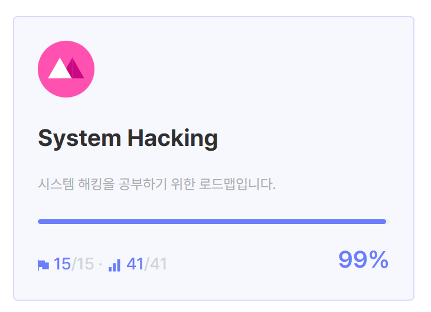
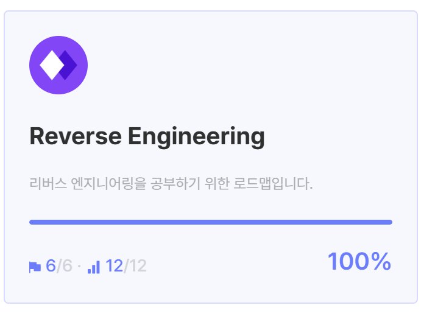

# 동계 모각소 개인 학습 페이지

## 활동 정리
### 2025.01.08
#### dreamhack
- [off_by_one_001](/hack/dreamhack/off_by_one_001/README.md)

### 2025.01.09
#### dreamhack
- [tcache_dup](/hack/dreamhack//tcache_dup/README.md)

### 2025.01.10
#### baekjoon
- [찐 Even Numbe(32981)](/algorithm/baekjoon/32981/README.md)
- [흩날리는 시험지 속에서 내 평점이 느껴진거야(17951)](/algorithm/baekjoon/17951/README.md)

### 2025.01.12
#### baekjoon
- [전설의 JBNU(12757)](/algorithm/baekjoon/12757/README.md)

### 2025.01.13
#### baekjoon
- [벌레컷(27651)](/algorithm/baekjoon/27651/README.md)
- [구간합 구하기(2042)](/algorithm/baekjoon/2042/README.md)

### 2025.01.14
#### baekjooon
- [최솟값과 최댓값(2357)](/algorithm/baekjoon/2357/README.md)
- [구간곱 구하기(11505)](/algorithm/baekjoon/11505/README.md)

### 2025.01.15
#### develop
- [카카오맵을 사용한 대학교 지도 사이트(카카오 맵 사용, 대학교 검색)](/develop/map/)

### 2025.01.16
#### algorithm
- [축구(1344)](/algorithm/baekjoon/1344/README.md)
- [알고리즘 수업 - 피보나치 수 1(24416)](/algorithm/baekjoon/24416/README.md)

### 2025.01.19
#### develop
- [코드포스(Div.3)](/algorithm/codeforce/20250119/)

### 2025.01.20
#### algorithm
- [피보나치수와 최대공약수(11778)](/algorithm/baekjoon/11778/README.md)

### 2025.01.25
#### algorithm
- [나이트의 이동(7562)](/algorithm/baekjoon/7562/README.md)

### 2025.01.26
#### dreamhack
- [tcache_dup2](/hack/dreamhack/tcache_dup2/README.md)
- [sint](/hack/dreamhack/sint/README.md)

### 2025.01.31
#### algorithm
- [나이트의 여행(4161)](/algorithm/baekjoon/4161/README.md)

### 2025.02.01
#### dreamhack
- [validator](/hack/dreamhack/validator/README.md)
- 드림핵 System hacking 학습 과정 완료

### 2025.02.04
#### algorithm
- [간선 끊어가기(14285)](/algorithm/baekjoon/14285/README.md)
- [그래프 게임(30411)](/algorithm/baekjoon/30411/README.md)
### 2025.02.05
#### sql
- [131112](/sql/programmers/131112.SQL)
- [131118](/sql/programmers/131118.sql)
- [131120](/sql/programmers/131120.SQL)
- [131535](/sql/programmers/131535.SQL)
- [131536](/sql/programmers/131536.sql)
- [131537](/sql/programmers/131537.sql)
- [132201](/sql/programmers/132201.SQL)
- [132203](/sql/programmers/132203.SQL)
- [133024](/sql/programmers/133024.SQL)
- [133025](/sql/programmers/133025.SQL)
- [144853](/sql/programmers/144853.SQL)
- [151136](/sql/programmers/151136.sql)
- [164673](/sql/programmers/164673.SQL)
- [273711](/sql/programmers/273711.SQL)
- [276013](/sql/programmers/276013.SQL)
- [276034](/sql/programmers/276034.SQL)
- [293258](/sql/programmers/293258.SQL)
- [298517](/sql/programmers/298517.SQL)
- [298518](/sql/programmers/298518.SQL)
- [299305](/sql/programmers/299305.SQL)
- [299307](/sql/programmers/299307.SQL)
- [301646](/sql/programmers/301646.SQL)
- [301647](/sql/programmers/301647.SQL)
- [301649](/sql/programmers/301649.SQL)
- [301650](/sql/programmers/301650.SQL)
- [301651](/sql/programmers/301651.SQL)
- [59035](/sql/programmers/59035.sql)

### 2025.02.08
#### algorithm
- [최고의 간선(25050)](/algorithm/baekjoon/25050/README.md)
#### dreamhack
- [off_by_one_000](/hack/dreamhack/off_by_one_000/README.md)

### 2025.02.09
#### dreamhack
- [rev-basic-0](/hack/dreamhack/rev-basic-0/README.md)
- [rev-basic-1](/hack/dreamhack/rev-basic-1/README.md)
- [rev-basic-3](/hack/dreamhack/rev-basic-3/README.md)

### 2025.02.10
#### dreamhack
- [patch](/hack/dreamhack/patch//README.md)
- [please, please, please](/hack/dreamhack/please%20please%20please/README.md)

### 2025.02.11
#### algorithm
- [최단경로(1753)](/algorithm/baekjoon/1753/README.md)
- [가장 긴 증가하는 부분 수열4(14002)](/algorithm/baekjoon/14002/README.md)
- [Euclid(19171)](/algorithm/baekjoon/19171/README.md)

### 2025.02.13
#### algorithm
- [최소비용 구하기 2(11779)](/algorithm/baekjoon/11779/README.md)
- [여행가자(1976)](/algorithm/baekjoon/1976/README.md)

### 2025.02.14
#### dreamhack
- [p_rho](/hack/dreamhack/p_rho/README.md)

### 2025.02.15
#### algorithm
- [합과 곱(1353)](/algorithm/baekjoon/1353/README.md)
- [가장 긴 증가하는 부분수열 3(12738)](/algorithm/baekjoon/12738/README.md)
- [가장 긴 증가하는 부분수열 5(14003)](/algorithm/baekjoon/14003/README.md)
- [가장 긴 증가하는 부분수열 2(12015)](/algorithm/baekjoon/12015/README.md)
- [A/B 2(15792)](/algorithm/baekjoon/15792/README.md)
- [매우 어려운 문제(31738)](/algorithm/baekjoon/31738/README.md)
- [다음 소수(4134)](/algorithm/baekjoon/4134/README.md)

### 2025.02.16
#### dreamhack
- [Double DES](/hack/dreamhack/double%20DES/README.md)

### 2025.02.17
#### algirithm
- [LCA 2(11438)](/algorithm/baekjoon/11438/README.md)

### 2025.02.21
#### algorithm
- [좌표 압축(18870)](/algorithm/baekjoon/18870/README.md)
- [행렬 제곱(10830)](/algorithm/baekjoon/10830/README.md)
- [Strongly Connected Component(2150)](/algorithm/baekjoon/2150/README.md)

## 주제
### 1. 알고리즘 -> [이동](/algorithm/README.md)
### 2. 컴퓨터과학 -> [이동](/computer_science/README.md)
### 3. 해킹 -> [이동](/hack/README.md)
### 4. SQL -> [이동](/sql/README.md)

## 성과
### Segment Tree
[세그트리 구현](/algorithm/study/segtree/README.md)
### fft
[fft 구현](/algorithm/study/fft/README.md)
### 드림핵 System hacking 학습 과정 완료

### 프로그래머스 sql 고득점 kit - SELECT 완료

### 드림핵 Reverse Engineering 학습 과정 완료

### solved.ac 플레티넘 달성
