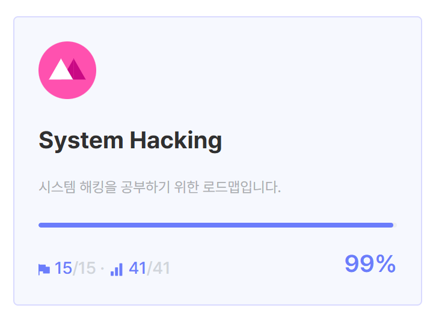
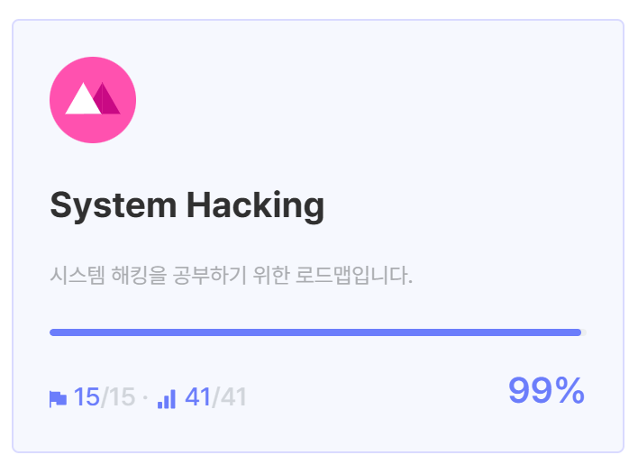

# 드림핵

## 1. 문제해설

### 2025.01.08
1. [off_by_one_001](/hack/dreamhack/off_by_one_001/README.md)

### 2025.01.09
2. [tcache_dup](/hack/dreamhack/tcache_dup/README.md)

### 2025.01.26
- [tcache_dup2](/hack/dreamhack/tcache_dup2/README.md)
- [sint](/hack/dreamhack/sint/README.md)

### 2025.02.01
- [validator](/hack/dreamhack/validator/README.md)

### 2025.02.08
- [off_by_one_000](/hack/dreamhack/off_by_one_000/README.md)

### 2025.02.09
- [rev-basic-0](/hack/dreamhack/rev-basic-0/README.md)
- [rev-basic-1](/hack/dreamhack/rev-basic-1/README.md)
- [rev-basic-3](/hack/dreamhack/rev-basic-3/README.md)

### 2025.02.10
- [patch](/hack/dreamhack/patch//README.md)
- [please, please, please](/hack/dreamhack/please%20please%20please/README.md)

## 성과
### system hacking 드림핵 학습 과정 완료

