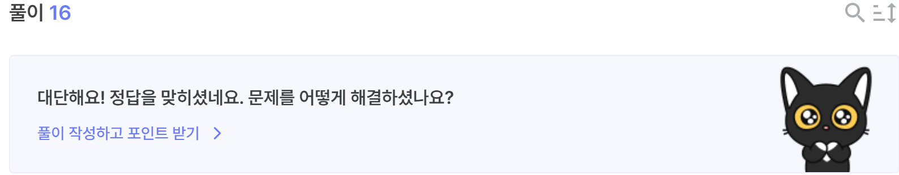

# Double DES
- [문제페이지](https://dreamhack.io/wargame/challenges/1118)

## 문제해설
```python
#!/usr/bin/env python3
from Crypto.Cipher import DES
import signal
import os

if __name__ == "__main__":
    signal.alarm(15)

    with open("flag", "rb") as f:
        flag = f.read()
    
    key = b'Dream_' + os.urandom(4) + b'Hacker'
    key1 = key[:8]
    key2 = key[8:]
    print("4-byte Brute-forcing is easy. But can you do it in 15 seconds?")
    cipher1 = DES.new(key1, DES.MODE_ECB)
    cipher2 = DES.new(key2, DES.MODE_ECB)
    encrypt = lambda x: cipher2.encrypt(cipher1.encrypt(x))
    decrypt = lambda x: cipher1.decrypt(cipher2.decrypt(x))

    print(f"Hint for you :> {encrypt(b'DreamHack_blocks').hex()}")

    msg = bytes.fromhex(input("Send your encrypted message(hex) > "))
    if decrypt(msg) == b'give_me_the_flag':
        print(flag)
    else:
        print("Nope!")
```

이를 보면, des 암호로 DREAM_????Hacker을 키로 하는 암호 함수를 만들어 give_me_the_flag와 비교하는 것을 알 수 있다.

이때, Dream_??, ??_Hacker로 따로 암호화 되기 때문에 이를 따로 구한 후 이를 key로 정해 원하는 값을 넘기면 된다.

이를 코드로 작성하면

```python
from pwn import *
from Crypto.Cipher import DES
from tqdm import trange

p = remote('host1.dreamhack.games', 18957)

p.recvuntil(b":> ")
hint = bytes.fromhex(p.recvline().decode())

d = {}

for i in trange(2**16):
    key = b'Dream_' + i.to_bytes(2, "big")
    cipher = DES.new(key, DES.MODE_ECB)
    
    r = cipher.encrypt(b'DreamHack_blocks')
    d[r] = key

for i in trange(2**16):
    key = i.to_bytes(2, "big") + b'Hacker'
    cipher = DES.new(key, DES.MODE_ECB)

    r = cipher.decrypt(hint)

    if r in d:
        real_key = d[r] + key

key1 = real_key[:8]
key2 = real_key[8:]

cipher1 = DES.new(key1, DES.MODE_ECB)
cipher2 = DES.new(key2, DES.MODE_ECB)

encrypt = lambda x: cipher2.encrypt(cipher1.encrypt(x))

p.sendline(encrypt(b'give_me_the_flag').hex())
p.interactive()
```

```
[+] Opening connection to host1.dreamhack.games on port 20882: Done
100%|█████████████████████████████████████████████████████████████████████████| 65536/65536 [00:00<00:00, 109630.95it/s]
100%|█████████████████████████████████████████████████████████████████████████| 65536/65536 [00:00<00:00, 111755.07it/s]
/mnt/c/users/samsung/desktop/my/workspace/study/2024_winter_mogakso/hack/dreamhack/double DES/exploit.py:36: BytesWarning: Text is not bytes; assuming ASCII, no guarantees. See https://docs.pwntools.com/#bytes
  p.sendline(encrypt(b'give_me_the_flag').hex())
[*] Switching to interactive mode
Send your encrypted message(hex) > b'DH{ca1e86a77d8dd3285f50dac3aa0d285ceba38f274ed8d57109f3ac1adb3f850e}'
[*] Got EOF while reading in interactive
```

다음과 같이 잘 실행되어 flag를 얻을 수 있다.

