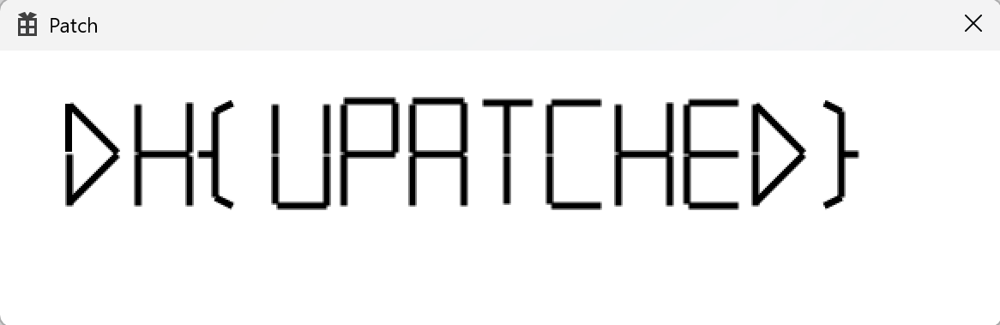

# patch

- [문제페이지](https://dreamhack.io/wargame/challenges/49)

## 문제해설

이 문제는 Win32와 gdi++를 사용하는 문제이다.

어셈블리를 읽어보면 winproc에서 draw를, draw에서 hide_text를 실행하고 있다. 따라서, hide_text를 실행하지 못하도록 바로 ret하면

다음과 같다.