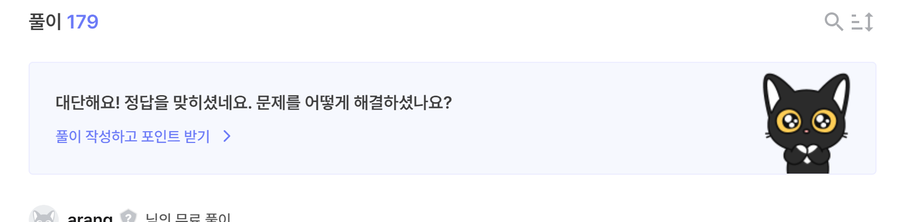

# rev-basic-1

- [문제페이지](https://dreamhack.io/wargame/challenges/15)

## 문제해설

실행파일을 실행하면

```bash
Input : 
```
다음과 같이 표시된다.

따라서, 이를 실행하는 함수를 찾으면

```c
__int64 sub_140001350()
{
  char v1; // [rsp+20h] [rbp-118h]

  memset(&v1, 0, 0x100ui64);
  sub_1400013E0("Input : ");
  sub_140001440("%256s", &v1);
  if ( (unsigned int)sub_140001000(&v1) )
    puts("Correct");
  else
    puts("Wrong");
  return 0i64;
}
```

다음과 같다. 

sub_140001000를 살펴보면

```c
_BOOL8 __fastcall sub_140001000(_BYTE *a1)
{
  if ( *a1 != 67 )
    return 0i64;
  if ( a1[1] != 111 )
    return 0i64;
  if ( a1[2] != 109 )
    return 0i64;
  if ( a1[3] != 112 )
    return 0i64;
  if ( a1[4] != 97 )
    return 0i64;
  if ( a1[5] != 114 )
    return 0i64;
  if ( a1[6] != 51 )
    return 0i64;
  if ( a1[7] != 95 )
    return 0i64;
  if ( a1[8] != 116 )
    return 0i64;
  if ( a1[9] != 104 )
    return 0i64;
  if ( a1[10] != 101 )
    return 0i64;
  if ( a1[11] != 95 )
    return 0i64;
  if ( a1[12] != 99 )
    return 0i64;
  if ( a1[13] != 104 )
    return 0i64;
  if ( a1[14] != 52 )
    return 0i64;
  if ( a1[15] != 114 )
    return 0i64;
  if ( a1[16] != 97 )
    return 0i64;
  if ( a1[17] != 99 )
    return 0i64;
  if ( a1[18] != 116 )
    return 0i64;
  if ( a1[19] != 51 )
    return 0i64;
  if ( a1[20] == 114 )
    return a1[21] == 0;
  return 0i64;
}
```

다음과 같다. 이를 일일이 확인하여도 되지만 귀찮기 때문에 python코드로 만들어 key를 얻으면

```python
a = [67, 111,109,112,97,114,51,95,116,104,101,95,99,104,52,114,97,99,116,51,114, 0]

print("DH{", end="")
for i in a:
    print(chr(i), end="")
print("}")
```

```
DH{Compar3_the_ch4ract3r}
```
다음과 같다.

